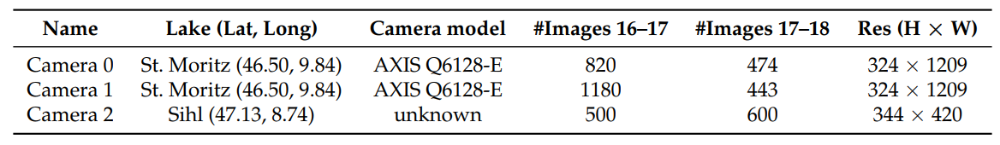
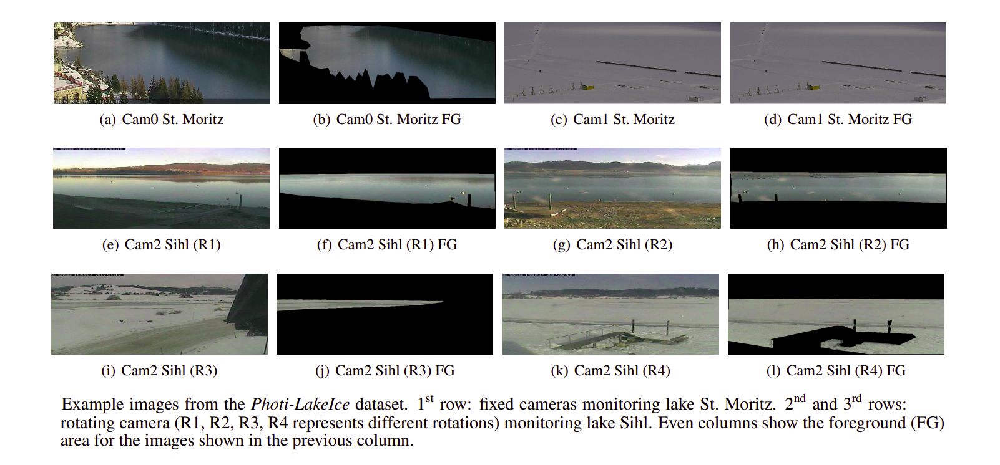
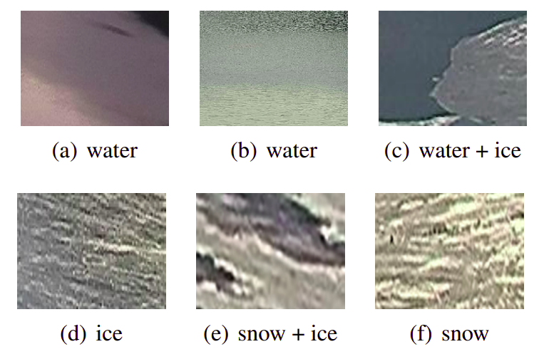
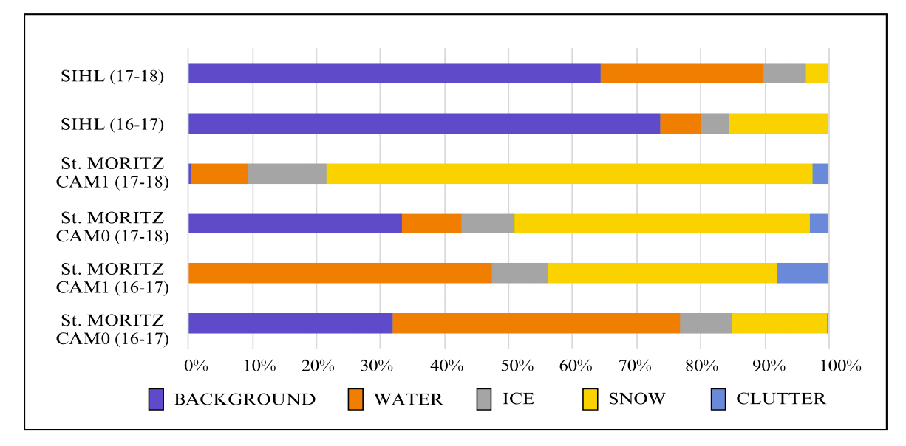
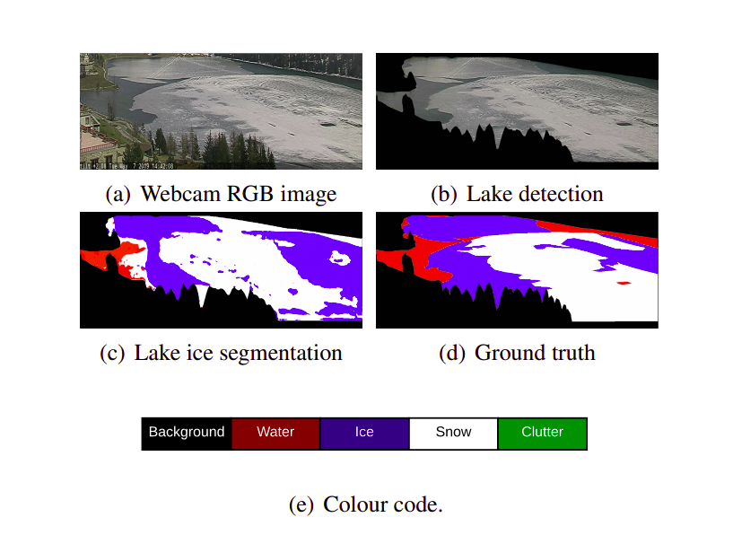
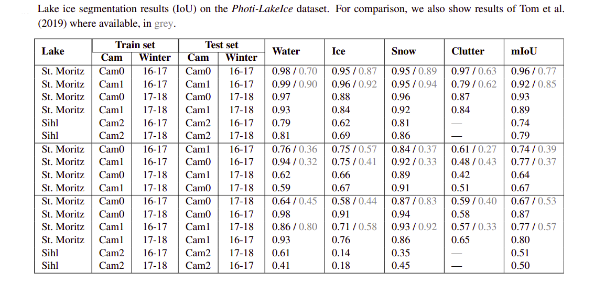
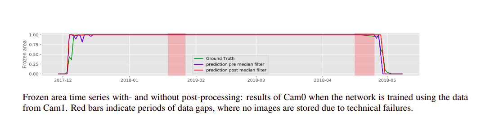
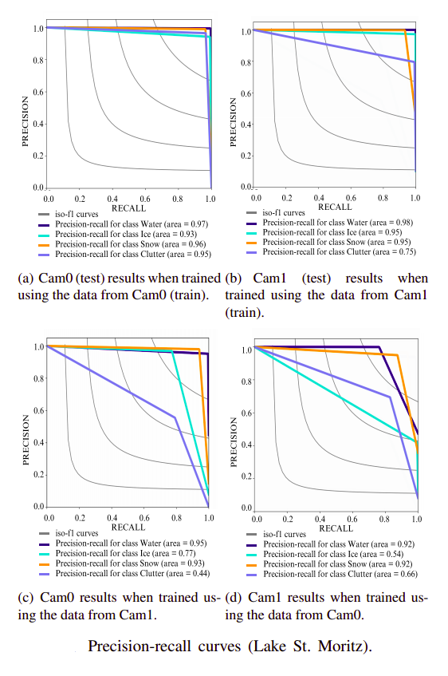

# Photi-LakeIce Dataset

This is a repository dedicated for the Photi-LakeIce dataset described in the paper:
[Lake Ice Monitoring with Webcams and Crowd-​Sourced Images (Prabha et.al., 2020)](https://arxiv.org/pdf/2002.07875.pdf)

## What this repo contains?
1. [Link](https://share.phys.ethz.ch/~pf/tommdata/Dataset.tar.xz) to download the Photi-LakeIce dataset with (a) RGB images, (b) pixel-wise ground truth annotations
2. [Link](https://share.phys.ethz.ch/~pf/tommdata/Pre-trained_Model.tar.xz) to download the Deeplabv3+ model pre-trained on Photi-LakeIce datset
3. Details about the Photi-LakeIce dataset


## Dataset details

#### Folder structure 
  ```bash
├── dataset
    ├── lake
        ├── winter
            ├── camera
                ├── data
                ├── labels
├── readme.txt
```
#### Naming convention for each image in the 'Data' and 'Labels' folders
Lake_camera_year_monthdate_hour_minute.jpg (Lake Sihl images)
example: Sihl_Cam2_2016_1221_10_07.jpg
Lake_camera_year_monthdate_hour_minute.png (Lake StMoritz images)
example: StMoritz_Cam1_2016_1221_10_07.png

#### Ground truth annotation (4 Class) 
- ice
- snow
- water
- clutter

#### 2 Winters included
- 2016-17 
- 2017-18

#### Lakes included
- Sihl (47.1370° N, 8.7801° E) located in Canton Schwyz, Switzerland
- St. Moritz (46.4942° N, 9.8449° E) located in Canton Graubuenden, Switzerland

#### Cameras
- 2 from lake St. Moritz (Cam0, Cam 1)
- 1 from lake Sihl (Cam 2)



#### Example images


#### Texture variability


#### Class imbalance


#### Some results of [Prabha et.al. (2020)](https://arxiv.org/pdf/2002.07875.pdf)

##### Qualitative results


##### Quantitative results


##### Timeline results


##### Precision-Recall curves



## Citation
Kindly cite our paper, if you use this repo:

@inproceedings{prabha_tom_2020:isprs,
author={Prabha, R. and Tom, M. and Rothermel, M. and Baltsavias, E. and Leal-Taixe, L. and Schindler, K.},
booktitle={arXiv preprint: arXiv:2002.07875v2},
title={Lake Ice Monitoring with Webcams and Crowd-Sourced Images},
year={2020},
}


## References
1. Tom, M., Suetterlin, M., Bouffard, D., Rothermel, M., Wunderle, S., Baltsavias, E., 2019. [Integrated monitoring of ice
in selected Swiss lakes](https://ethz.ch/content/dam/ethz/special-interest/baug/igp/photogrammetry-remote-sensing-dam/documents/pdf/Misc/Ice%20Lake_Final_Report_draft15.pdf). Final Project Report
2. [Github repo (Tensorflow code)](https://github.com/czarmanu/deeplab-lakeice-webcams) of Prabha et. al. (2020)
